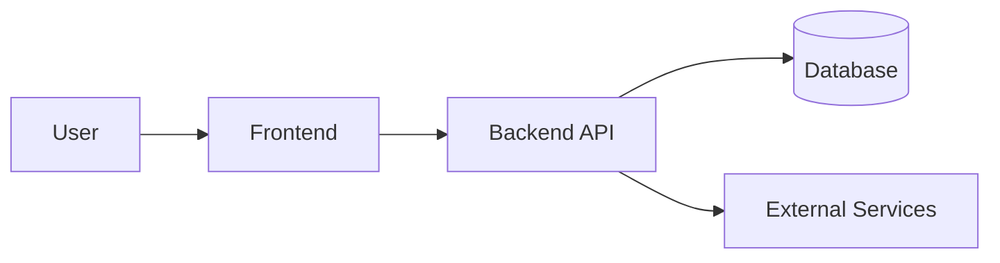

# 02 — ARCHITECTURE (Template)

## Chosen Stack
- Frontend: {{FRONTEND_STACK}}
- Backend: {{BACKEND_STACK}}
- Database: {{DB_STACK}}
- Auth: {{AUTH_STRATEGY}}
- Hosting: {{HOSTING_TARGET}}
- CI: {{CI_TOOL}}

## System Diagram

## Modules
Frontend:
- {{FE_MODULE_1}}
Backend:
- {{BE_MODULE_1}}

## ADRs
- ADR-001: {{DECISION}}
- ADR-002: {{DECISION}}
