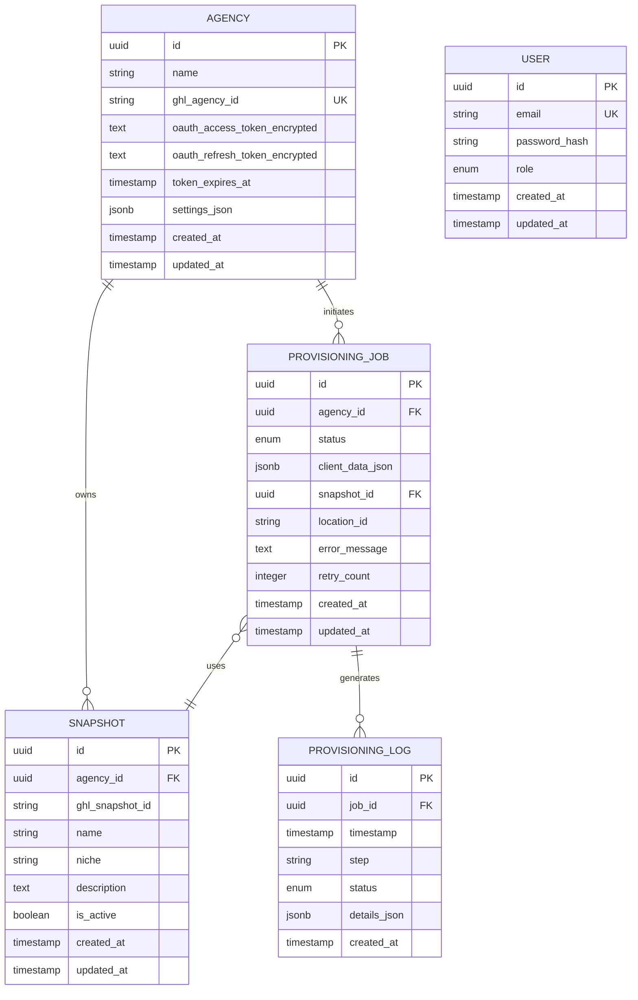

# 03 — DATA MODEL

## Overview

The GHL Provisioning Agent uses a PostgreSQL database to manage:
- **Agencies**: OAuth-connected GoHighLevel partner agencies
- **Snapshots**: Account templates/blueprints stored in GHL
- **Provisioning Jobs**: Async provisioning tasks for creating client accounts
- **Provisioning Logs**: Audit trail for provisioning steps and status changes
- **Users**: Dashboard access control and authentication

---

## Entity Definitions

### Entity: Agency

| Field | Type | Required | Unique | Notes |
|-------|------|----------|--------|-------|
| id | uuid | yes | yes | Primary key, v4 |
| name | varchar(255) | yes | no | Agency display name |
| ghl_agency_id | varchar(255) | yes | yes | GoHighLevel agency identifier |
| oauth_access_token_encrypted | text | yes | no | Encrypted GHL OAuth access token |
| oauth_refresh_token_encrypted | text | yes | no | Encrypted GHL OAuth refresh token |
| token_expires_at | timestamp | yes | no | OAuth token expiration time |
| settings_json | jsonb | no | no | Agency configuration (defaults, preferences) |
| created_at | timestamp | yes | no | Record creation timestamp |
| updated_at | timestamp | yes | no | Record update timestamp |

**Purpose**: Stores OAuth credentials and settings for partner agencies connecting via GHL OAuth flow.

---

### Entity: ProvisioningJob

| Field | Type | Required | Unique | Notes |
|-------|------|----------|--------|-------|
| id | uuid | yes | yes | Primary key, v4 |
| agency_id | uuid | yes | no | Foreign key → Agency(id) |
| status | enum | yes | no | One of: PENDING, IN_PROGRESS, COMPLETED, FAILED, RETRYING |
| client_data_json | jsonb | yes | no | Client account data to provision (name, email, etc.) |
| snapshot_id | uuid | no | no | Foreign key → Snapshot(id) |
| location_id | varchar(255) | no | no | GHL location ID if provisioned |
| error_message | text | no | no | Error details if status=FAILED |
| retry_count | integer | no | no | Number of retry attempts (default: 0) |
| created_at | timestamp | yes | no | Job creation timestamp |
| updated_at | timestamp | yes | no | Job status update timestamp |

**Purpose**: Tracks individual provisioning jobs initiated by agencies to create client accounts.

---

### Entity: Snapshot

| Field | Type | Required | Unique | Notes |
|-------|------|----------|--------|-------|
| id | uuid | yes | yes | Primary key, v4 |
| agency_id | uuid | yes | no | Foreign key → Agency(id) |
| ghl_snapshot_id | varchar(255) | yes | no | GoHighLevel snapshot identifier |
| name | varchar(255) | yes | no | Snapshot display name |
| niche | varchar(255) | no | no | Industry/niche the snapshot targets |
| description | text | no | no | Snapshot description and features |
| is_active | boolean | yes | no | Whether snapshot is available for use (default: true) |
| created_at | timestamp | yes | no | Record creation timestamp |
| updated_at | timestamp | yes | no | Record update timestamp |

**Purpose**: Represents account templates/blueprints stored in GHL that can be used as base for new client accounts.

---

### Entity: ProvisioningLog

| Field | Type | Required | Unique | Notes |
|-------|------|----------|--------|-------|
| id | uuid | yes | yes | Primary key, v4 |
| job_id | uuid | yes | no | Foreign key → ProvisioningJob(id) |
| timestamp | timestamp | yes | no | Log entry timestamp |
| step | varchar(255) | yes | no | Provisioning step name (e.g., "VALIDATE_SNAPSHOT", "CREATE_LOCATION") |
| status | varchar(50) | yes | no | Step status: STARTED, COMPLETED, FAILED |
| details_json | jsonb | no | no | Step-specific details, errors, or context |
| created_at | timestamp | yes | no | Log record creation timestamp |

**Purpose**: Provides detailed audit trail of provisioning job execution for debugging and monitoring.

---

### Entity: User

| Field | Type | Required | Unique | Notes |
|-------|------|----------|--------|-------|
| id | uuid | yes | yes | Primary key, v4 |
| email | varchar(255) | yes | yes | User email address |
| password_hash | varchar(255) | yes | no | Bcrypt-hashed password |
| role | varchar(50) | yes | no | User role: ADMIN, AGENCY_ADMIN, SUPPORT (default: AGENCY_ADMIN) |
| created_at | timestamp | yes | no | Record creation timestamp |
| updated_at | timestamp | yes | no | Record update timestamp |

**Purpose**: Manages dashboard user accounts and access control for the provisioning agent interface.

---

## Relationships

```
Agency 1—N ProvisioningJob
Agency 1—N Snapshot
ProvisioningJob N—1 Snapshot (optional)
ProvisioningJob 1—N ProvisioningLog
```

- An **Agency** can have multiple **ProvisioningJobs** and **Snapshots**
- A **ProvisioningJob** may use a **Snapshot** as a template (optional)
- A **ProvisioningJob** has many **ProvisioningLogs** for audit trail
- **User** is independent; can be tied to multiple agencies via application-level logic

---

## PostgreSQL Schema

```sql
-- Create enum types
CREATE TYPE provisioning_job_status AS ENUM (
    'PENDING',
    'IN_PROGRESS',
    'COMPLETED',
    'FAILED',
    'RETRYING'
);

CREATE TYPE user_role AS ENUM (
    'ADMIN',
    'AGENCY_ADMIN',
    'SUPPORT'
);

CREATE TYPE provisioning_step_status AS ENUM (
    'STARTED',
    'COMPLETED',
    'FAILED'
);

-- Agency table
CREATE TABLE agencies (
    id UUID PRIMARY KEY DEFAULT gen_random_uuid(),
    name VARCHAR(255) NOT NULL,
    ghl_agency_id VARCHAR(255) NOT NULL UNIQUE,
    oauth_access_token_encrypted TEXT NOT NULL,
    oauth_refresh_token_encrypted TEXT NOT NULL,
    token_expires_at TIMESTAMP NOT NULL,
    settings_json JSONB,
    created_at TIMESTAMP NOT NULL DEFAULT CURRENT_TIMESTAMP,
    updated_at TIMESTAMP NOT NULL DEFAULT CURRENT_TIMESTAMP
);

CREATE INDEX idx_agencies_ghl_agency_id ON agencies(ghl_agency_id);
CREATE INDEX idx_agencies_token_expires_at ON agencies(token_expires_at);
CREATE INDEX idx_agencies_created_at ON agencies(created_at);

-- Snapshot table
CREATE TABLE snapshots (
    id UUID PRIMARY KEY DEFAULT gen_random_uuid(),
    agency_id UUID NOT NULL REFERENCES agencies(id) ON DELETE CASCADE,
    ghl_snapshot_id VARCHAR(255) NOT NULL,
    name VARCHAR(255) NOT NULL,
    niche VARCHAR(255),
    description TEXT,
    is_active BOOLEAN NOT NULL DEFAULT true,
    created_at TIMESTAMP NOT NULL DEFAULT CURRENT_TIMESTAMP,
    updated_at TIMESTAMP NOT NULL DEFAULT CURRENT_TIMESTAMP
);

CREATE INDEX idx_snapshots_agency_id ON snapshots(agency_id);
CREATE INDEX idx_snapshots_ghl_snapshot_id ON snapshots(ghl_snapshot_id);
CREATE INDEX idx_snapshots_is_active ON snapshots(is_active);
CREATE UNIQUE INDEX idx_snapshots_agency_ghl_id ON snapshots(agency_id, ghl_snapshot_id);

-- ProvisioningJob table
CREATE TABLE provisioning_jobs (
    id UUID PRIMARY KEY DEFAULT gen_random_uuid(),
    agency_id UUID NOT NULL REFERENCES agencies(id) ON DELETE CASCADE,
    status provisioning_job_status NOT NULL DEFAULT 'PENDING',
    client_data_json JSONB NOT NULL,
    snapshot_id UUID REFERENCES snapshots(id) ON DELETE SET NULL,
    location_id VARCHAR(255),
    error_message TEXT,
    retry_count INTEGER DEFAULT 0,
    created_at TIMESTAMP NOT NULL DEFAULT CURRENT_TIMESTAMP,
    updated_at TIMESTAMP NOT NULL DEFAULT CURRENT_TIMESTAMP
);

CREATE INDEX idx_provisioning_jobs_agency_id ON provisioning_jobs(agency_id);
CREATE INDEX idx_provisioning_jobs_status ON provisioning_jobs(status);
CREATE INDEX idx_provisioning_jobs_snapshot_id ON provisioning_jobs(snapshot_id);
CREATE INDEX idx_provisioning_jobs_created_at ON provisioning_jobs(created_at);
CREATE INDEX idx_provisioning_jobs_updated_at ON provisioning_jobs(updated_at);
CREATE INDEX idx_provisioning_jobs_agency_status ON provisioning_jobs(agency_id, status);

-- ProvisioningLog table
CREATE TABLE provisioning_logs (
    id UUID PRIMARY KEY DEFAULT gen_random_uuid(),
    job_id UUID NOT NULL REFERENCES provisioning_jobs(id) ON DELETE CASCADE,
    timestamp TIMESTAMP NOT NULL DEFAULT CURRENT_TIMESTAMP,
    step VARCHAR(255) NOT NULL,
    status provisioning_step_status NOT NULL,
    details_json JSONB,
    created_at TIMESTAMP NOT NULL DEFAULT CURRENT_TIMESTAMP
);

CREATE INDEX idx_provisioning_logs_job_id ON provisioning_logs(job_id);
CREATE INDEX idx_provisioning_logs_timestamp ON provisioning_logs(timestamp);
CREATE INDEX idx_provisioning_logs_step ON provisioning_logs(step);
CREATE INDEX idx_provisioning_logs_job_timestamp ON provisioning_logs(job_id, timestamp DESC);

-- User table
CREATE TABLE users (
    id UUID PRIMARY KEY DEFAULT gen_random_uuid(),
    email VARCHAR(255) NOT NULL UNIQUE,
    password_hash VARCHAR(255) NOT NULL,
    role user_role NOT NULL DEFAULT 'AGENCY_ADMIN',
    created_at TIMESTAMP NOT NULL DEFAULT CURRENT_TIMESTAMP,
    updated_at TIMESTAMP NOT NULL DEFAULT CURRENT_TIMESTAMP
);

CREATE INDEX idx_users_email ON users(email);
CREATE INDEX idx_users_role ON users(role);
CREATE INDEX idx_users_created_at ON users(created_at);
```

---

## Entity Relationship Diagram (Mermaid)



---

## Constraints & Business Rules

### Agency
- `ghl_agency_id` must be unique (one agency integration per GHL agency)
- `token_expires_at` drives OAuth refresh token workflow
- `settings_json` is flexible for future agency-specific configurations

### ProvisioningJob
- `status` drives state machine: PENDING → IN_PROGRESS → COMPLETED/FAILED
- Jobs can be RETRYING if they fail and are queued for retry
- `retry_count` capped at configurable limit (e.g., 3) before marking as FAILED
- `snapshot_id` is optional; jobs can provision without a template
- `location_id` populated only after successful GHL location creation

### Snapshot
- Composite unique key on `(agency_id, ghl_snapshot_id)` ensures no duplicates per agency
- `is_active` allows soft-disabling snapshots without deletion
- `niche` and `description` support filtering/search in UI

### ProvisioningLog
- Cascading delete with job ensures audit trail cleanup
- `details_json` captures step-specific context (API responses, validation errors, etc.)
- Composite index on `(job_id, timestamp DESC)` for efficient log retrieval

### User
- Password hash uses bcrypt (min cost 12)
- Roles determine dashboard permissions and agency access
- Email is unique globally for login

---

## Indexes Strategy

| Table | Index | Purpose |
|-------|-------|---------|
| `agencies` | `ghl_agency_id` | OAuth lookup by GHL identifier |
| `agencies` | `token_expires_at` | Find agencies needing token refresh |
| `snapshots` | `agency_id, ghl_snapshot_id` | Prevent duplicates, fast lookup by agency |
| `snapshots` | `is_active` | Filter active snapshots only |
| `provisioning_jobs` | `agency_id, status` | Query jobs by status per agency |
| `provisioning_jobs` | `status` | Global job queue filtering |
| `provisioning_jobs` | `created_at, updated_at` | Time-based queries and cleanup |
| `provisioning_logs` | `job_id, timestamp DESC` | Efficient audit trail retrieval |
| `users` | `email` | Login and user lookup |

---

## Migrations Strategy

### Tool
- **Alembic** (Python SQLAlchemy) or **Flyway** (Java) depending on application stack
- Version control all migrations in `migrations/` directory
- Timestamp-based naming: `YYYYMMDD_HHMMSS_description.sql`

### Seed Strategy
- Create initial seed data script for test/demo agencies:
  - `seeds/001_demo_agencies.sql` — Demo agency with OAuth tokens
  - `seeds/002_demo_snapshots.sql` — Sample snapshots for demo agency
- Run seeds only in development/staging via `psql -f seeds/*.sql`
- Production uses live OAuth integration; no seed data needed

### Migration Examples

**001_initial_schema.sql** — Create all tables and indexes (shown in PostgreSQL Schema section above)

**002_add_audit_columns.sql** (example for future updates)
```sql
ALTER TABLE agencies ADD COLUMN deleted_at TIMESTAMP NULL;
CREATE INDEX idx_agencies_deleted_at ON agencies(deleted_at) WHERE deleted_at IS NULL;
```

---

## Data Types & Validation

| Column | Validation | Notes |
|--------|------------|-------|
| `ghl_agency_id` | Non-empty string, max 255 chars | Provided by GHL OAuth |
| `email` | Valid email format, max 255 chars | RFC 5322 compliant |
| `oauth_access_token_encrypted` | Non-null, encrypted at rest | Never stored plaintext |
| `status` (ProvisioningJob) | Must match enum | Enforced by database type |
| `retry_count` | 0 ≤ count ≤ max_retries | Application logic enforces cap |
| `client_data_json` | Valid JSON, required fields | Schema validation at app layer |
| `settings_json` | Valid JSON or NULL | Flexible structure for future use |

---

## Encryption Strategy

### Fields Encrypted at Rest
- `oauth_access_token_encrypted`
- `oauth_refresh_token_encrypted`

### Implementation
- **Algorithm**: AES-256-GCM
- **Key Management**: Rotate via environment-based key (or AWS KMS in production)
- **Encryption/Decryption**: Handled at application layer (ORM hooks) before DB storage
- **Audit**: Never log plaintext tokens; log only hashed identifiers for tracing

---

## Performance Considerations

1. **JSONB Indexing**: Use `GIN` indexes on `settings_json`, `client_data_json`, `details_json` if querying by key:
   ```sql
   CREATE INDEX idx_client_data_gin ON provisioning_jobs USING GIN (client_data_json);
   ```

2. **Connection Pooling**: Use PgBouncer (default 100 connections) for production

3. **Archival Strategy**: Move completed jobs and logs older than 90 days to archive table to keep main tables lean

4. **Materialized Views**: Consider for reporting on job success rates by agency/niche

---

## Testing & Seeding

### Test Fixtures
```sql
-- Seed test data
INSERT INTO agencies (id, name, ghl_agency_id, oauth_access_token_encrypted, oauth_refresh_token_encrypted, token_expires_at)
VALUES (
    'f47ac10b-58cc-4372-a567-0e02b2c3d479'::uuid,
    'Test Agency',
    'test-ghl-agency-001',
    'encrypted_token_here',
    'encrypted_refresh_here',
    NOW() + INTERVAL '30 days'
);

INSERT INTO snapshots (id, agency_id, ghl_snapshot_id, name, niche, is_active)
VALUES (
    '550e8400-e29b-41d4-a716-446655440000'::uuid,
    'f47ac10b-58cc-4372-a567-0e02b2c3d479'::uuid,
    'snapshot-001',
    'Real Estate Startup',
    'Real Estate',
    true
);
```

---

## Summary

This data model supports:
- **OAuth Integration**: Secure token storage with encryption
- **Async Provisioning**: Job queue with status tracking and retries
- **Audit Trail**: Complete logging of provisioning steps
- **Multi-Tenancy**: Agency isolation via foreign keys
- **User Management**: Dashboard access control
- **Scalability**: Proper indexing and query optimization ready
